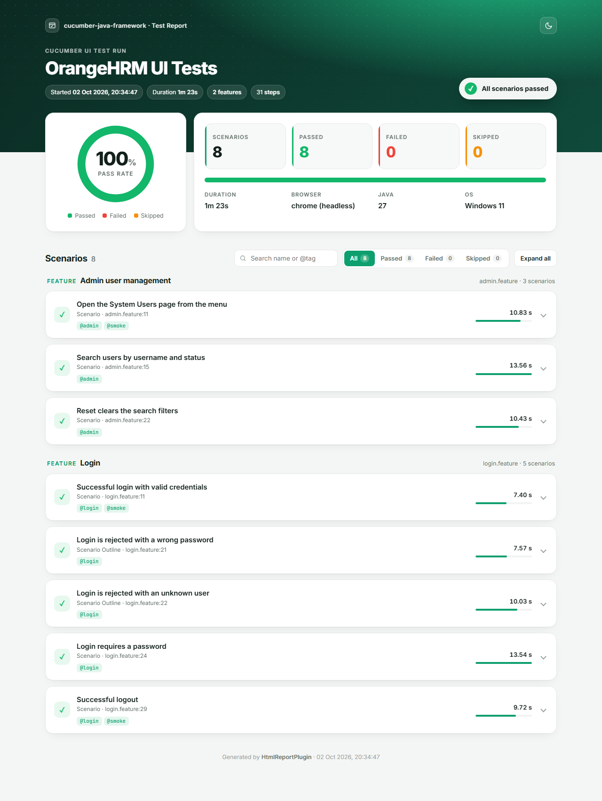

# cucumber-java-framework

A BDD UI test automation framework built with **Java 17**, **Cucumber**, **Selenium WebDriver** and the **JUnit Platform** (JUnit 6).

It tests the public [OrangeHRM demo](https://opensource-demo.orangehrmlive.com) application: logging in and out, rejecting bad credentials, and searching system users on the Admin page. Scenarios are written in plain-English Gherkin, and every run produces a single self-contained HTML report.

## Tech stack

| Tool | Purpose |
|------|---------|
| Java 17 | Language |
| Maven | Build and dependency management |
| Cucumber 8 | Gherkin feature files, step definitions and hooks |
| Selenium WebDriver 4 | Browser automation (Selenium Manager downloads the driver) |
| JUnit Platform 6 | Runs the features (`@Suite` + Cucumber engine) and provides the assertions (Jupiter) |
| PicoContainer | Shares one `TestContext` between hooks and steps per scenario |

## Project structure

```
cucumber-java-framework
├── docs/images                       Screenshots used in this README
├── pom.xml                           Maven dependencies and plugins
└── src
    ├── main/java/com/automation/ui
    │   ├── config
    │   │   └── Config                Settings from config.properties (overridable with -D)
    │   ├── driver
    │   │   └── DriverFactory         One browser per thread: chrome, firefox or edge, optional headless
    │   ├── pages                     Page objects
    │   │   ├── BasePage              Click / type / read helpers with explicit waits
    │   │   ├── AppPage               Layout shared after login: side menu, page title, logout
    │   │   ├── LoginPage
    │   │   ├── DashboardPage
    │   │   └── SystemUsersPage       Admin → User Management: filters and result table
    │   └── report
    │       └── HtmlReportPlugin      Generates the custom HTML test report
    ├── test/java/com/automation/ui
    │   ├── context
    │   │   └── TestContext           Per-scenario state: config and page objects
    │   ├── hooks
    │   │   └── Hooks                 Starts/stops the browser, screenshot on failure
    │   ├── runners
    │   │   └── TestRunner            JUnit Platform suite: features, glue, report plugins
    │   └── steps
    │       ├── LoginSteps
    │       └── AdminSteps
    └── test/resources
        ├── config.properties         Base URL, browser, headless, timeout, credentials
        └── features
            ├── login.feature
            └── admin.feature
```

## How it works

The framework has three layers:

1. **Feature files** (`features/*.feature`) describe behaviour in Gherkin and contain no code.
2. **Step definitions** (`steps`) turn each Gherkin line into calls on page objects and JUnit assertions. They contain no locators.
3. **Page objects** (`pages`) hold the locators and the actions of one page. `BasePage` waits for every element explicitly, so there are no `Thread.sleep` calls or implicit waits.

`Hooks` opens a fresh browser before each scenario and closes it afterwards. PicoContainer creates one `TestContext` per scenario and passes it to the hooks and every step class through their constructors, so nothing is shared through static fields.

### Scenarios

**Login** (`login.feature`)

| Scenario | Checks |
|----------|--------|
| Successful login with valid credentials | Dashboard URL and title |
| Login is rejected with a wrong password / an unknown user | "Invalid credentials" banner (Scenario Outline) |
| Login requires a password | "Required" field message |
| Successful logout | Back on the login page |

**Admin user management** (`admin.feature`)

| Scenario | Checks |
|----------|--------|
| Open the System Users page from the menu | URL and page title |
| Search users by username and status | Every result row has the searched username and status |
| Reset clears the search filters | Username and Status filters are empty again |

Scenarios are tagged `@login`, `@admin` and `@smoke`.

## Prerequisites

- JDK 17 or newer
- Maven 3.6 or newer
- Chrome (default), Firefox or Edge installed
- Internet access (the tests use the live OrangeHRM demo site)

No driver binary is needed: Selenium Manager downloads the matching driver on the first run.

## Running the tests

From the project root:

```bash
mvn clean test
```

Common options (any value in `config.properties` can be overridden with `-D`):

```bash
mvn clean test -Dheadless=true                     # no browser window
mvn clean test -Dbrowser=firefox                   # chrome | firefox | edge
mvn clean test -Dcucumber.filter.tags="@smoke"     # run a subset by tag
mvn clean test -Dcucumber.filter.tags="@login and not @smoke"
```

To run from an IDE, right-click `TestRunner` (or a `.feature` file with the Cucumber plugin) and choose **Run**.

Results are written to `target/`:

- `cucumber-reports/ui-test-report.html`: the custom HTML report (see below)
- `cucumber-reports/cucumber.html`, `cucumber.json`, `cucumber.xml`: Cucumber's standard reports
- `screenshots/`: a PNG of the browser for every failed scenario
- `surefire-reports/`: Surefire results (one test per scenario)

## HTML report

`HtmlReportPlugin` (registered in `TestRunner`) writes a single self-contained HTML file after each run. Open it in any browser; it needs no other files, so it can be shared or archived on its own.

It shows:

- a header with the start time, duration, number of features and steps, and an overall verdict
- a pass-rate ring, scenario counts with a stacked result bar, and the browser, Java version and OS
- scenarios grouped by feature, each with its tags, location, and a duration bar scaled to the slowest scenario
- every Gherkin step with a pass/fail/skip mark, highlighted parameters and its duration
- messages written with `scenario.log(...)` and images attached with `scenario.attach(...)`, including the screenshot taken when a scenario fails
- the error message and a collapsible stack trace for failed scenarios (failed scenarios open automatically)
- a search box (scenario name, feature or `@tag`), status filters, expand/collapse all and a light/dark theme toggle



## Configuration

| What | Where |
|------|-------|
| Base URL, browser, headless, wait timeout, credentials | `src/test/resources/config.properties`, or `-D<key>=...` |
| Which features, glue and report plugins run | `@SelectClasspathResource` and `@ConfigurationParameter` in `TestRunner` |
| Locators | the page object classes under `pages` |

## Adding a new test

1. Write the scenario in a `.feature` file under `src/test/resources/features`.
2. If it uses a new page, add a page object under `pages` that extends `AppPage` (or `BasePage` for pages shown before login).
3. Add a getter for the new page in `TestContext`.
4. Add the step definitions to a class under `steps` that takes `TestContext` in its constructor.
5. Run `mvn clean test`. Cucumber prints a snippet for any step that has no definition yet.
